# IAP_Measurement

This project was written for the MECH 463 design course at McGill University. The purpose is to power a Raspberry Pi that controls a device made to measure intra-abdominal pressure (IAP). The study of IAP can lead to many advancements in the medical field due to its close ties to intra-abdominal hypertension (IAH) and spinal stability. The objective was to develop a device with a reversible pressure pump to measure the IAP of medical patients and obtain pressure-volume curves to analyze mechanical properties of the abdominal wall. 

A Raspberry Pi Zero W was selected as the microprocessor for this design. The Pi Zero has 40 general purpose input/output (GPIO) pins. Some of these can be used to control and collect data from sensors, which can be directly powered by the Pi Zero’s 5V or 3.3V pins to provide the necessary power requirements to these sensors. An optical displacement sensor was required to measure the distance travelled by the piston in order to calculate the volumetric displacement. The Adafruit VL6180X Time of Flight Distance Ranging Sensor was selected for this purpose. This sensor can precisely measure the distance between itself and an object between 5 mm and 100 mm away, with a resolution of 1mm. This sensor is digital and uses i2C communication, meaning that it can directly interact with the RBP, with no need for an analog to digital converter.

Next, the pressure sensor used was the Adafruit BMP388 - Precision Barometric Pressure and Altimeter. The BMP388 has an operational range between 300 and 1250 hPa absolute pressure (225 to 938 mmHg) which puts it within the project requirement range of +/- 150 mmHg gage pressure. Additionally, it has an accuracy of +/- 0.4 hPa, or 0.3 mmHg, which means it also conforms to the project requirements. This sensor is digital and uses i2C or SPI communication, meaning that it can directly interact with the RBP. 

The following schematic shows the circuit used to connect the sensors to the Pi Zero W:

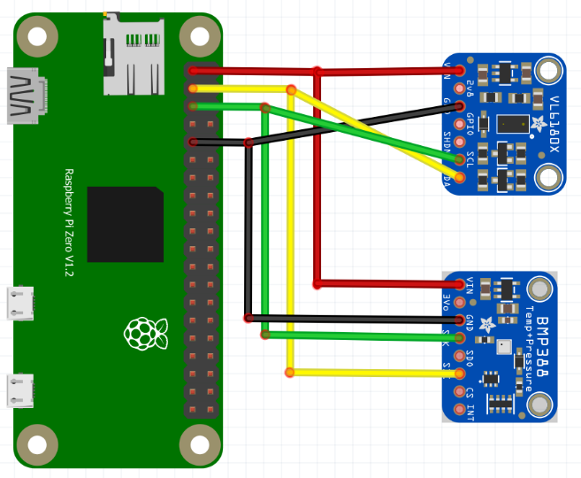

For the distance sensor, the following pins are connected:
    • Pi Zero W 3V3 to sensor VIN 
    • Pi Zero W GND to sensor GND 
    • Pi Zero W SCL to sensor SCL 
    • Pi Zero W SDA to sensor SDA
For the pressure sensor, the following pins are connected:
    • Pi Zero W 3V3 to sensor VIN 
    • Pi Zero W GND to sensor GND 
    • Pi Zero W SCL to sensor SCI 
    • Pi Zero W SDA to sensor SDK

Next, in order to fulfill the requirement of displaying pressure-volume curves in real-time as the measurement is being taken, a web-based solution taking advantage of the RBP’s Wi-Fi capabilities was created.

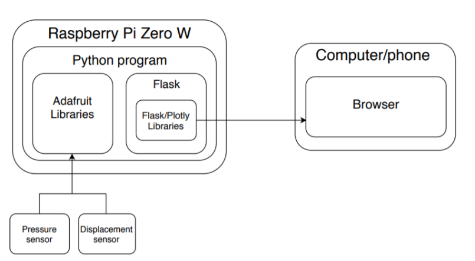

The diagram above illustrates the principle of operation of the software. The Plotly library, specifically its Dash web framework, allows the creation of interactive, real-time plots in a browser. A Python program running on the Raspberry Pi collects the sensor data, and writes it into the RBP’s filesystem, to allow for future viewing after the test. While performing a test, the program will send this data to the Flask web server, for creation of live plots using Plotly and Dash.

Due to the Covid-19 pandemic abruptly ending activities, the electronics were not fully integrated into the physical prototype. However, the electronics and software were completed and tested outside of the prototype.

The program is accessed by typing the IP address of the device connected to the local network. This IP can be found by pinging “raspberrypi.local” on the local network. Alternatively, for use in an area with many routers such as a school or hospital, it is better to have the RBP can emit its own hotspot that can be connected to and in which the IP address remains constant. The RBP is configured to start the IAP measurement program on startup, therefore the device needs only to be powered on and the user can then access it from any browser. The program includes three different pages: the homepage, IAP Measurement page and Database page. The Home page displays information about the device and how to use it. The IAP Measurement page enables the user to take an IAP measurement and view live-plots, and the Database page allows the user to retrieve previous measurements as CSV files or delete these measurements. Screenshots of the full functionality of the program are shown below.

When the program is first accessed, the Home page is displayed by default.

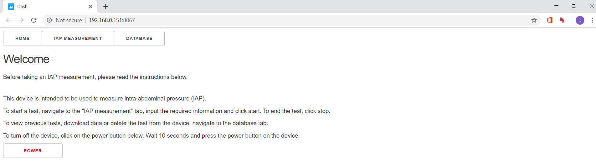

The user can navigate to the IAP Measurement page.

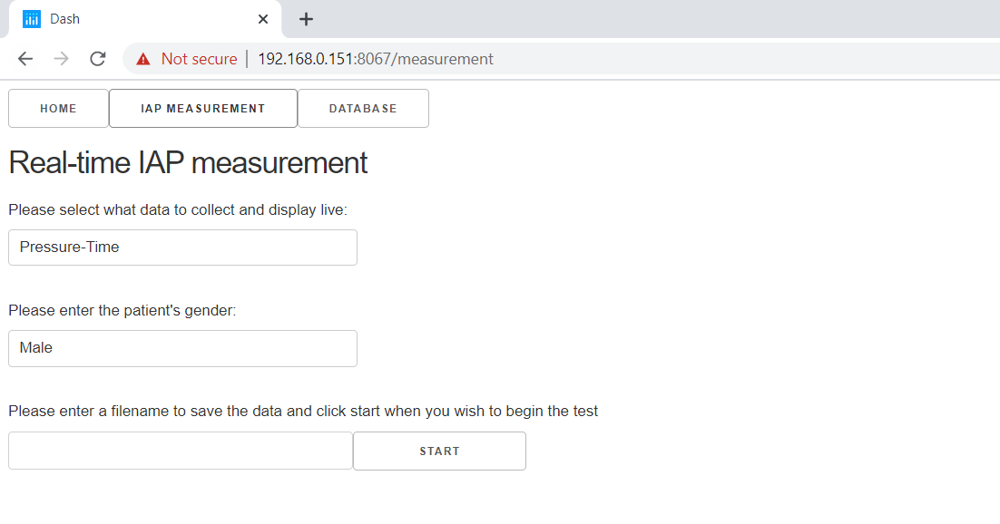

Different options are available to the user. Three types of graphs may be plotted:

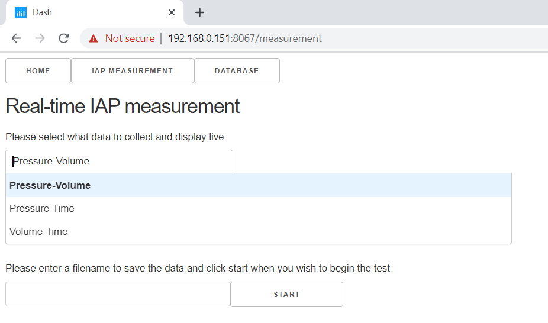

The pressure-volume curve is desired as per the project requirements. However, pressure-time and volume-time curves are also useful to testing and prototyping purposes and may also have potential uses in device application. The user must also input the patient’s gender, as there are anatomical differences between men and women which mean that different correlation coefficients are required. Finally, the user is asked to name the test. When the user starts a test, the graph will immediately start plotting sensor data.

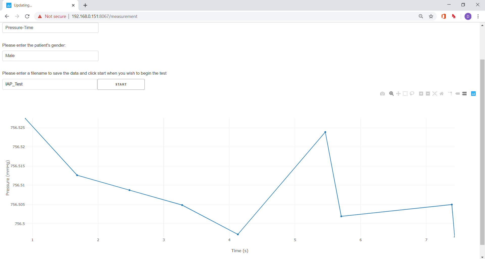

Once the test is complete, the user may scroll to the bottom of the page and press the stop button. This brings the user to the posttest page.

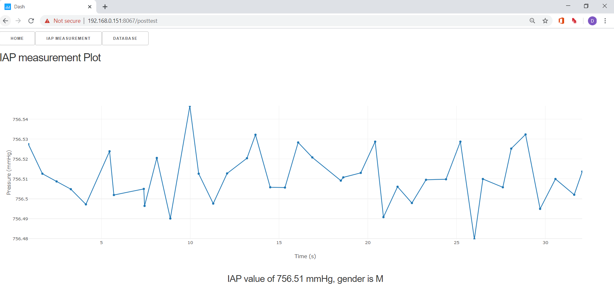

The IAP value measured is normally displayed under the graph. For testing purposes, it calculates an average of all data points collected. Subsequently, the user may choose to go over previous tests to compare, download or delete data. This can be done in the Database page.

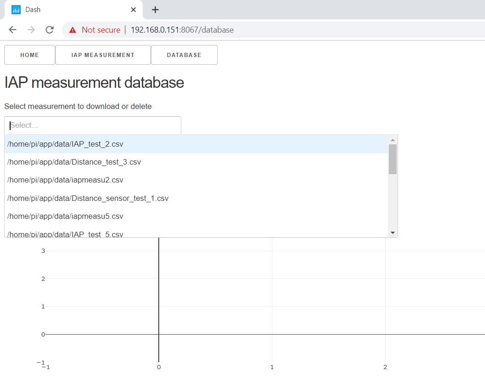

Once the user selects whichever test they would like to download or delete, it is shown, along with the calculated IAP:

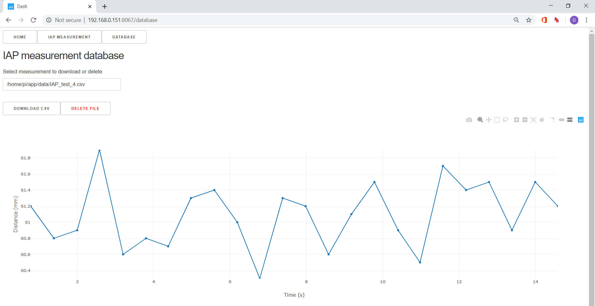

If the user chooses to delete the file, it is permanently deleted from the database. If the user wishes to download the data, a csv file is downloaded.

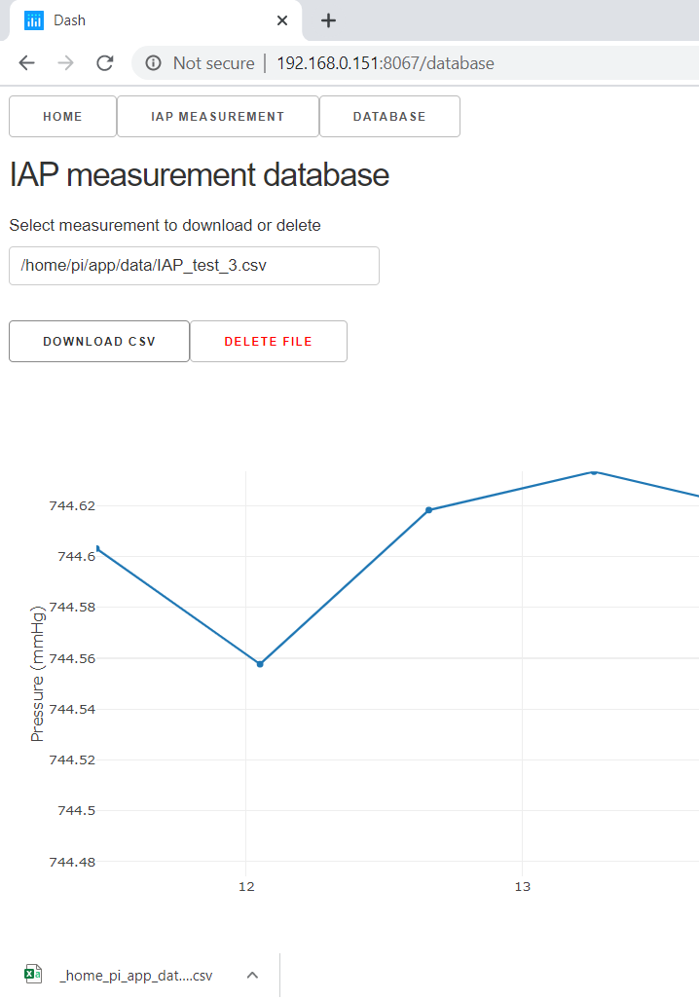

CSV file example:

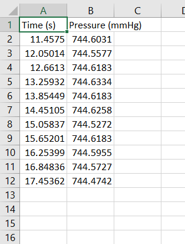